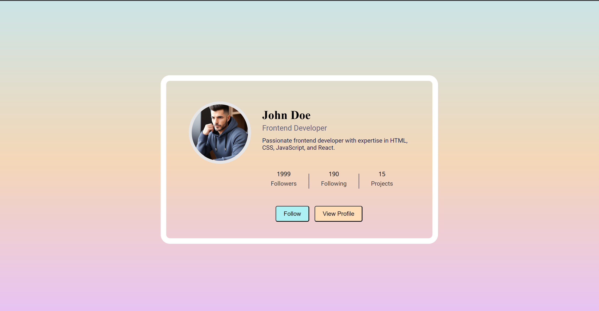

**Profile Card Component Readme**

### Overview
Welcome to the Profile Card Component challenge! In this project, you'll be tasked with building a responsive profile card that displays essential information about a user or individual. This readme will guide you through the project requirements, structure, and provide some tips to help you successfully complete the challenge.

### Challenge Description
The Profile Card Component challenge aims to enhance your frontend development skills by building a real-world component from scratch. You'll be using HTML and CSS to create a visually appealing profile card that showcases key information about a person. This challenge is perfect for beginners looking to improve their frontend skills and learn about CSS Flexbox layouts.

### Requirements
To successfully complete the challenge, you'll need to fulfill the following requirements:

1. Display a profile image, name, job title, and a short bio.
2. Show the number of followers, following, and projects completed.
3. Include two buttons: "View Profile" and "Follow."
4. Ensure the component is responsive and displays correctly on different screen sizes.
5. Match the design as closely as possible.

### Getting Started
To get started with the challenge, you can follow these steps:

1. Clone or download the project repository:
   
   git clone https://github.com/Yashi-Singh-1/Profile-Card-Component.git
   
2. Open the project in your preferred code editor.
3. Review the design specifications provided in the  file.
4. Begin coding the profile card component using HTML and CSS.
5. Test the component's responsiveness on various devices and screen sizes.
6. Refine and adjust the styling to match the design closely.

### Tips
Here are some tips to help you successfully complete the challenge:

- Use CSS Flexbox to layout the profile card elements efficiently.
- Pay attention to detail and strive for pixel-perfect accuracy with the design.
- Test your component across different browsers to ensure compatibility.
- Utilize media queries to create a responsive design that adapts to various screen sizes.
- Experiment with CSS transitions and animations to add interactivity to the component.

### Contributing
We welcome contributions from the community to improve the Profile Card Component challenge. If you have any suggestions, bug fixes, or enhancements, feel free to submit a pull request. Please ensure that your contributions align with the project's goals and follow the contribution guidelines outlined in the repository.

### Learning Objectives
By working on this challenge, you'll have the opportunity to:

- Gain hands-on experience with HTML and CSS.
- Learn how to create responsive web components.
- Understand the importance of design consistency and accuracy.
- Improve your frontend development skills in a practical, real-world project.

### Conclusion
We hope you enjoy working on the Profile Card Component challenge and find it valuable for improving your frontend skills. Don't hesitate to refer back to this readme if you encounter any difficulties or need guidance throughout the project. Happy coding!
